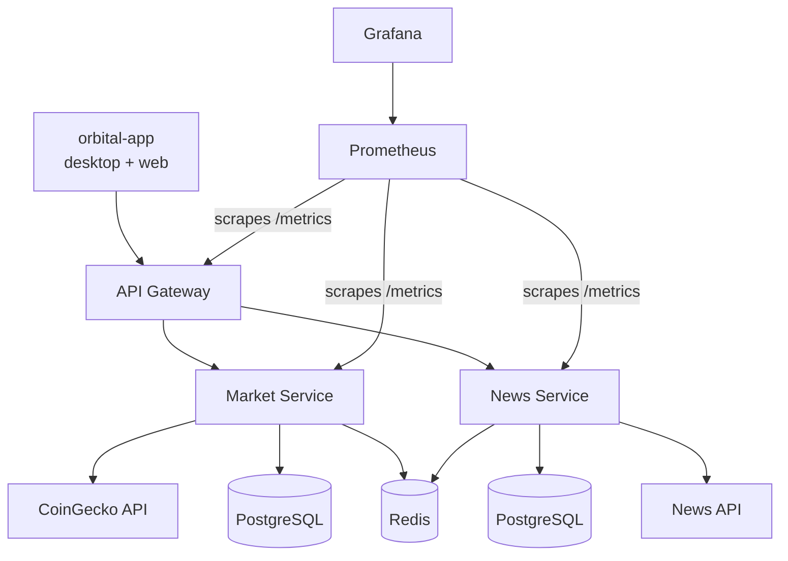

# Orbital News & Market
<div align="center">
  
</div>

> Orbital is a microservices-based platform that aggregates real-time cryptocurrency market data and financial news, with a Kotlin Multiplatform client (desktop + web) on top.

___

> [](LICENSE) <br>
> [](https://github.com/LoCh3f/orbital/network/members) <br>
> [](https://github.com/LoCh3f/orbital/stargazers) <br>
> [](https://github.com/LoCh3f/orbital/watchers) <br>


## 🚀 Features

- **Real-time Market Data** - Live cryptocurrency prices from CoinGecko, proxied and cached by the gateway, persisted to Postgres
- **News Aggregation** - Currently a mocked fallback feed; real NewsAPI integration is deliberately deferred (cost)
- **Desktop & Web Client** - `orbital-app`, one Kotlin Multiplatform (Compose) codebase targeting JVM desktop and `wasmJs` web, with search/filtering/auto-refresh
- **Microservices Architecture** - Gateway + market-service + news-service, each independently deployable
- **RESTful APIs** - Consistent `ApiResponse` success/error envelope, proper HTTP status mapping
- **Docker** - Full local stack (services, 2x Postgres, Redis, Prometheus, Grafana, pgAdmin) via one `docker-compose.yml`
- **Observability** - Real Prometheus metrics + an auto-provisioned Grafana dashboard, structured JSON logs correlated by request ID across all three services
- **Hardening** - Gateway rate limiting, configurable CORS
- **CI/CD** - Tests, lint, commit-message linting, Docker image builds, automated releases ([release-please](https://github.com/googleapis/release-please)) and GitHub Pages deployment (web app + API docs) all run in GitHub Actions


## 📁 Project Structure

```
orbital/
├── gateway/               # API gateway: proxy, cache, CORS, rate limiting, request tracing
├── market-service/        # CoinGecko integration, Postgres persistence
├── news-service/          # NewsAPI integration (mocked), Postgres persistence
├── libs/
│   ├── core/               # shared Ktor plugins: serialization, monitoring, metrics, request tracing
│   └── models/              # shared domain models (JVM-only)
├── orbital-app/            # Kotlin Multiplatform client (desktop + wasmJs web)
├── monitoring/
│   ├── prometheus/          # scrape config (all three services)
│   └── grafana/              # auto-provisioned datasource + "Orbital Overview" dashboard
├── docker-compose.yml
├── gradle/libs.versions.toml   # centralized dependency versions
├── .github/workflows/          # test, docker-build, commitlint, release-please, deploy-web
├── release-please-config.json / .release-please-manifest.json
├── package.json / .husky/      # commit-message linting (commitlint)
├── settings.gradle.kts
└── build.gradle.kts
```


## 🏗️ Architecture



`orbital-app` (Compose Multiplatform, desktop + web) talks only to the gateway, never to the backend services directly. All three backend services expose `/health` and `/metrics`; Prometheus scrapes all three and Grafana visualizes them.

For build/run/deploy instructions, see [README.md](README.md).
