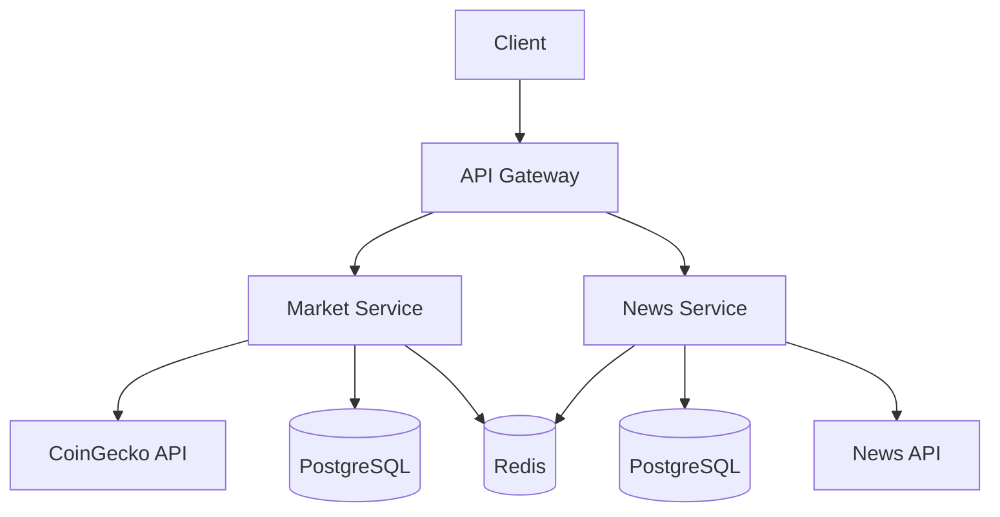

# Orbital News & Market

  

> Orbital is a microservices-based platform that aggregates real-time cryptocurrency market data and financial news.

___

>   
>   
>   
>   

## 🚀 Features

- **Real-time Market Data** - Live cryptocurrency prices and metrics
- **News Aggregation** - Financial news from multiple sources  
- **Microservices Architecture** - Scalable and maintainable
- **RESTful APIs** - Clean, documented endpoints
- **Docker** - Containerized deployment
- **Monitoring** - Prometheus & Grafana integration

## 📁 Project Structure

orbital/  
├── gateway/                  
├── market-service/           
├── news-service/             
├── libs/                     
│   ├── core/                 
│   └── models/               
├── docker-compose.yml        
└── monitoring/               

## 🏗️ Architecture

